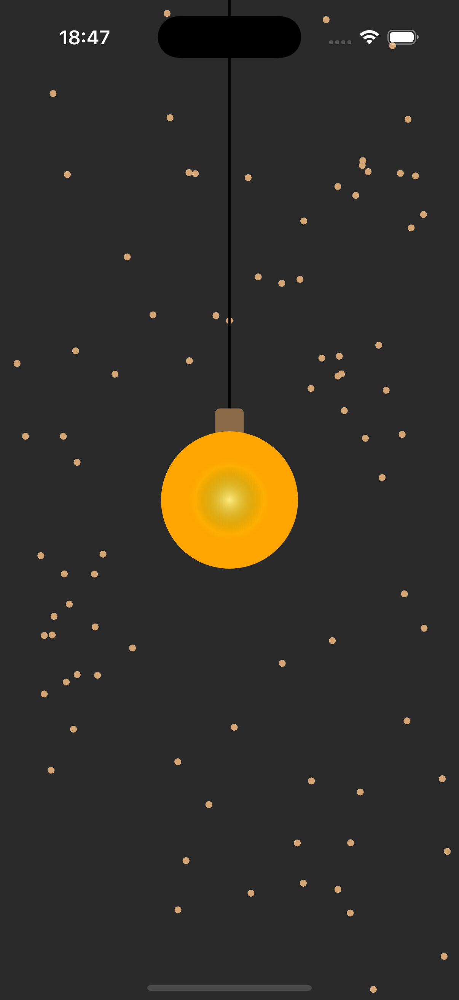
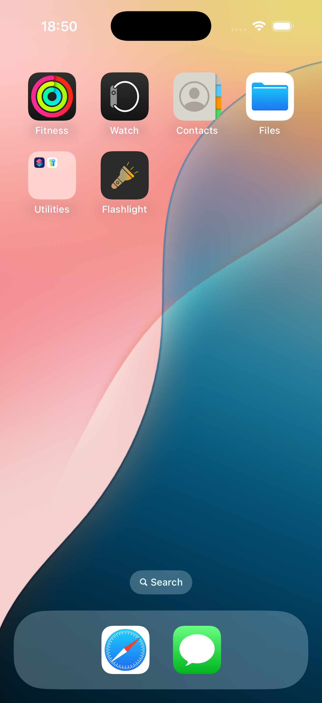

# 🔦 Flashlight App

A simple and minimal **Flashlight app** built with Flutter. This app allows users to toggle the flashlight on or off using a single button. It's designed to be fast, responsive, and easy to use.

## 👨🏻‍💻 App architecture

- MVVM architecture

## ✨ Features

- Toggle flashlight (torch) on/off
- Clean and minimal UI
- Works on Android and iOS
- Haptic feedback and sound on toggle

## 📱 Screenshots

 
 
 

## 🛠 Tech Stack

- [Flutter](https://flutter.dev)
- [Provider](https://pub.dev/packages/provider) for state management
- [audioplayers](https://pub.dev/packages/audioplayers) plugin

## 🚀 Getting Started

1. Clone the repo:
   ```bash
   git clone https://github.com/your-username/flashlight_app.git
   cd flashlight_app

